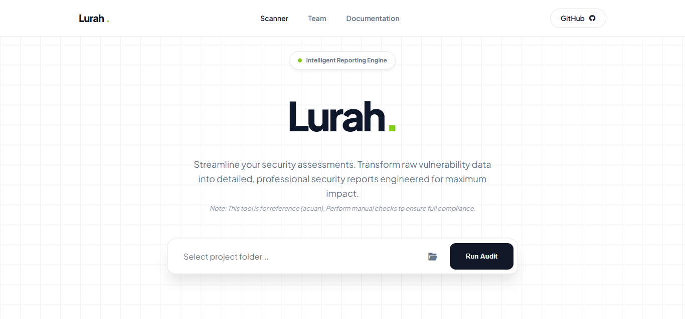
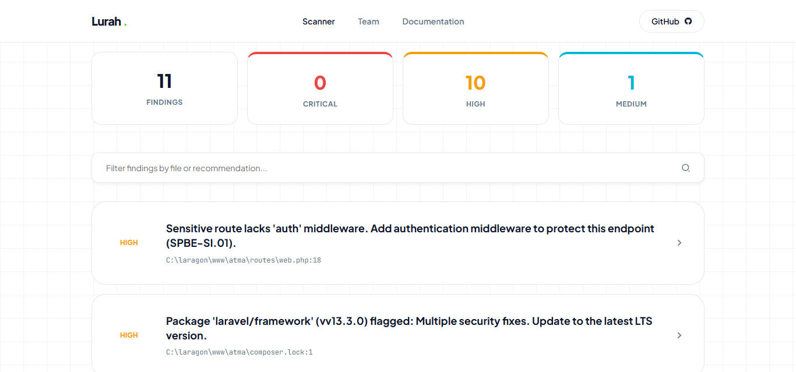
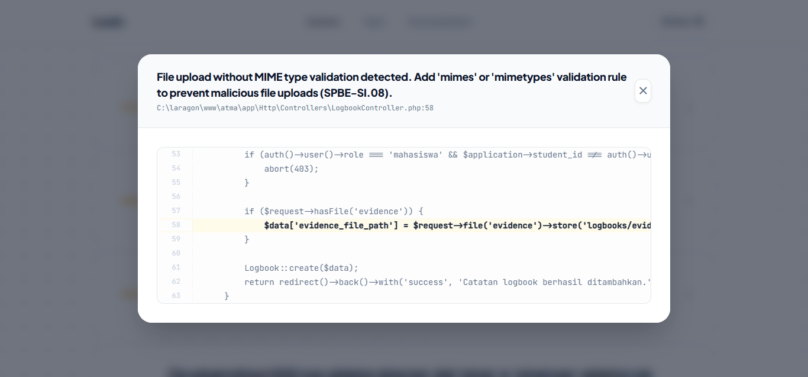

# Lurah

**Laravel Security Auditor for SPBE Compliance**

> **Note:** Lurah is a static analysis tool intended as a *reference* (acuan), not a replacement for manual security review. Automated scanning cannot catch every vulnerability — always perform a thorough manual audit alongside this tool to ensure full compliance.

Lurah is a cross-platform CLI tool written in Go that performs static security analysis on Laravel projects. It targets compliance with Indonesian government SPBE (*Sistem Pemerintahan Berbasis Elektronik*) standards.

```text
  ██╗     ██╗   ██╗██████╗  █████╗ ██╗  ██╗
  ██║     ██║   ██║██╔══██╗██╔══██╗██║  ██║
  ██║     ██║   ██║██████╔╝███████║███████║
  ██║     ██║   ██║██╔══██╗██╔══██║██╔══██║
  ███████╗╚██████╔╝██║  ██║██║  ██║██║  ██║
  ╚══════╝ ╚═════╝ ╚═╝  ╚═╝╚═╝  ╚═╝╚═╝  ╚═╝
```

---

## Table of Contents

- [Features](#features)
- [Installation](#installation)
- [Usage](#usage)
- [Scanners](#scanners)
- [Configuration](#configuration)
- [Output Formats](#output-formats)
- [Baseline System](#baseline-system)
- [Custom Rules](#custom-rules)
- [CI/CD Integration](#cicd-integration)
- [Project Structure](#project-structure)
- [SPBE Standard References](#spbe-standard-references)
- [Contributing](#contributing)
- [License](#license)

---

## Features

- **13 built-in security scanners** covering secrets, PII, SQL injection, XSS, CSRF, mass assignment, file uploads, authentication, middleware, dependencies, advisories, config, and environment drift
- **Interactive Web Dashboard**: Professional BugScribe-inspired UI for deep-dive auditing
- **Deep Code Inspector**: Jump directly from findings to source code with line highlighting
- **Live CVE checking** via Packagist Security Advisories API
- **Multi-line function-scope analysis** for PII detection
- **Auto-fix mode** to automatically patch simple issues
- **Watch mode** to re-scan on file changes
- **Baseline system** to suppress known issues and only report new ones
- **Custom rule engine** with user-defined regex patterns
- **SPBE Compliance Mapping**: Direct alignment with Indonesian government standards
- **Cross-platform** — Windows and Linux support
- **CI/CD friendly** — exits with code 1 on critical findings

---

---

## Web Dashboard

Lurah includes a professional, high-performance web dashboard featuring a "BugScribe" inspired aesthetic and deep technical insights.

### 1. Unified Command Center

*A high-fidelity interface for managing project security and SPBE compliance.*

### 2. Intelligent Reporting

*Live-searchable, severity-sorted results with intelligent pagination.*

### 3. Deep Code Inspector

*Pinpoint vulnerabilities with surgical precision using the in-dashboard source inspector.*

---

## Installation

### Prerequisites

- [Go 1.21+](https://go.dev/dl/)

### Build from source

```bash
git clone https://github.com/rheatkhs/lurah.git
cd lurah
go build -o lurah.exe .    # Windows
go build -o lurah .         # Linux/macOS
```

---

## Usage

### Interactive Menu

```bash
# Run without arguments to launch the interactive prompt UI
lurah
```

### Command Line Usage

```bash
# Launch the Web Dashboard (Recommended)
lurah web

# Scan the current directory
lurah scan

# Scan a specific project
lurah scan --path /var/www/my-app

# Windows
lurah.exe scan --path C:\laragon\www\my-project
```

### Filter by severity

```bash
lurah scan --min-severity HIGH
```

### Auto-fix

```bash
lurah scan --fix
```

### Output formats

```bash
# JSON output
lurah scan --format json

# SARIF output for GitHub Code Scanning
lurah scan --format sarif > results.sarif

# HTML report
lurah scan --html report.html
```

### Baseline

```bash
# Save current findings as baseline (for legacy projects)
lurah scan --baseline-create

# Only show new findings not in baseline
lurah scan --baseline
```

### Watch mode

```bash
lurah watch --path ./
```

### Initialize configuration

```bash
lurah init
```

### All flags

```text
Flags:
  -f, --format string         Output format: table, json, sarif (default "table")
      --min-severity string   Minimum severity: MEDIUM, HIGH, CRITICAL
      --fix                   Auto-fix simple issues
      --baseline              Only show findings not in baseline
      --baseline-create       Save current findings as baseline
      --html string           Generate HTML report to file path
  -p, --path string           Path to Laravel project root (default ".")
```

---

## Scanners

Lurah includes 13 built-in scanners:

| # | Scanner | What it detects | Severity |
| --- | --- | --- | --- |
| 1 | **Secret** | `APP_DEBUG=true` in non-local env, empty `APP_KEY` | CRITICAL |
| 2 | **PII** | 30 PII variables in Controllers (see below) | HIGH / MEDIUM |
| 3 | **SQL Injection** | `DB::raw()`, `whereRaw()`, `selectRaw()` with variable interpolation | CRITICAL |
| 4 | **XSS** | Unescaped Blade output `{!! $var !!}` in templates | HIGH |
| 5 | **CSRF** | Wildcard or excessive `$except` entries in `VerifyCsrfToken` | HIGH / MEDIUM |
| 6 | **Mass Assignment** | Eloquent models without `$fillable` or with `$guarded = []` | HIGH |
| 7 | **File Upload** | `store()`/`move()` without MIME validation, public disk storage | HIGH / MEDIUM |
| 8 | **Auth** | Insecure hashing (md5/sha1), weak session config, missing cookie flags | CRITICAL / HIGH / MEDIUM |
| 9 | **Middleware** | Sensitive routes without `auth` or `throttle` middleware | HIGH / MEDIUM |
| 10 | **Dependency** | Debug packages in production, outdated PHP requirement | HIGH / MEDIUM |
| 11 | **Advisory** | Live CVE lookup via Packagist Security Advisories API | CRITICAL |
| 12 | **Config** | Hardcoded `debug => true`, cleartext credentials in config/ | HIGH |
| 13 | **Env Diff** | Keys in `.env.example` missing from `.env`, placeholder values | MEDIUM |

### PII Detected Patterns

The PII scanner detects the following PHP variable names in Controllers:

| Category | Variables |
| --- | --- |
| **Indonesian Identity** | `$nik` (NIK), `$nip` (NIP), `$npwp` (NPWP), `$no_ktp`, `$no_kk`, `$no_sim`, `$no_passport`, `$no_bpjs` |
| **Financial** | `$rekening`, `$no_rekening`, `$no_rek`, `$kartu_kredit`, `$credit_card`, `$card_number` |
| **Contact / Personal** | `$no_hp`, `$no_telp`, `$phone_number`, `$alamat`, `$email`, `$tanggal_lahir`, `$tempat_lahir`, `$nama_ibu` |
| **Biometric / Sensitive** | `$sidik_jari`, `$foto_ktp`, `$password`, `$pin` |

If a PII variable is found inside a function that returns a JSON response, the finding is escalated to **HIGH**. Otherwise it is flagged as **MEDIUM**.

---

## Configuration

Run `lurah init` to generate a `.lurah.yaml`:

```yaml
# Lurah Configuration
version: "1.0"
exclude_paths:
  - vendor
  - node_modules
  - storage
  - .git
min_severity: MEDIUM
scanners:
  secret: true
  pii: true
  sqli: true
  csrf: true
  middleware: true
  dependency: true
  config: true
  env_diff: true
  xss: true
  mass_assignment: true
  file_upload: true
  auth: true
  advisory: true
pii:
  custom_patterns: []
custom_rules: []
```

---

## Output Formats

| Format | Flag | Use Case |
| --- | --- | --- |
| **Table** | `--format table` (default) | Human-readable terminal output with color-coded severity |
| **JSON** | `--format json` | Structured output for scripts and dashboards |
| **SARIF** | `--format sarif` | GitHub Code Scanning, SonarQube, and SARIF-compatible tools |
| **HTML** | `--html report.html` | Self-contained dark-themed report for stakeholders |

---

## Baseline System

For legacy projects with many existing findings, use the baseline system to focus on new issues:

```bash
# Step 1: Record current state as baseline
lurah scan --baseline-create

# Step 2: On subsequent runs, only show new findings
lurah scan --baseline
```

The baseline is stored in `.lurah-baseline.json`. Findings are matched by a hash of severity + filename + recommendation, so line number changes do not cause false positives.

---

## Custom Rules

Define project-specific rules in `.lurah.yaml`:

```yaml
custom_rules:
  - name: "no-dd"
    pattern: "\\bdd\\("
    target_dir: "app"
    extensions: "php"
    severity: "HIGH"
    message: "Debug function dd() found. Remove before deploying to production."

  - name: "no-env-direct"
    pattern: "\\benv\\("
    target_dir: "app"
    extensions: "php"
    severity: "MEDIUM"
    message: "Direct env() call in app code. Use config values instead."
```

Each rule supports:
- `pattern` — regex pattern to match
- `target_dir` — directory to scan (relative to project root)
- `extensions` — comma-separated file extensions
- `severity` — CRITICAL, HIGH, or MEDIUM
- `message` — custom recommendation text

---

## CI/CD Integration

### GitHub Actions

```yaml
name: Security Audit
on: [push, pull_request]
jobs:
  lurah:
    runs-on: ubuntu-latest
    steps:
      - uses: actions/checkout@v4
      - uses: actions/setup-go@v5
        with:
          go-version: '1.21'
      - run: go install github.com/rheatkhs/lurah@latest
      - run: lurah scan --format sarif > results.sarif
      - uses: github/codeql-action/upload-sarif@v3
        with:
          sarif_file: results.sarif
```

### Exit codes

| Code | Meaning |
| --- | --- |
| `0` | No critical findings |
| `1` | One or more CRITICAL findings detected |

---

## Project Structure

```text
lurah/
├── main.go                        # Entry point
├── cmd/
│   ├── root.go                    # Root command, banner, --path flag
│   ├── scan.go                    # Scan + watch commands, all flags
│   └── init.go                    # Init command (.lurah.yaml)
├── scanner/
│   ├── types.go                   # Finding struct, Severity constants
│   ├── secret.go                  # .env secret scanner
│   ├── pii.go                     # PII scanner (multi-line)
│   ├── sqli.go                    # SQL injection scanner
│   ├── xss.go                     # XSS scanner (Blade)
│   ├── csrf.go                    # CSRF exclusion scanner
│   ├── mass_assignment.go         # Mass assignment scanner
│   ├── upload.go                  # File upload scanner
│   ├── auth.go                    # Auth & session scanner
│   ├── middleware.go              # Route middleware auditor
│   ├── dependency.go              # Composer.lock + env diff
│   ├── advisory.go                # Packagist CVE lookup
│   ├── config.go                  # Config file scanner
│   ├── fix.go                     # Auto-fix logic
│   ├── baseline.go                # Baseline system
│   ├── custom_rules.go            # Custom rule engine
│   ├── lurah_config.go            # .lurah.yaml config
│   └── *_test.go                  # Unit tests
└── reporter/
    ├── table.go                   # Colored terminal table
    ├── json.go                    # JSON + SARIF formatters
    └── html.go                    # HTML report generator
```

---

## SPBE Standard References

| Code | Standard | Description |
| --- | --- | --- |
| SPBE-SI.01 | Otentikasi Pengguna | Authentication and session security |
| SPBE-SI.02 | Keamanan Kunci Enkripsi | Encryption key management |
| SPBE-SI.03 | Perlindungan Informasi Sensitif | Debug mode and secret exposure |
| SPBE-SI.04 | Pencegahan Injeksi | SQL injection prevention |
| SPBE-SI.05 | Perlindungan CSRF | Cross-site request forgery protection |
| SPBE-SI.06 | Pencegahan XSS | Cross-site scripting prevention |
| SPBE-SI.07 | Perlindungan Mass Assignment | Mass assignment protection |
| SPBE-SI.08 | Keamanan Unggah Berkas | File upload security |
| SPBE-PD.01 | Perlindungan Data Pribadi | Personal data masking and protection |

---

## Contributing

1. Fork the repository
2. Create a feature branch (`git checkout -b feature/new-scanner`)
3. Write tests for your changes
4. Ensure all tests pass (`go test ./...`)
5. Submit a Pull Request

### Adding a scanner

1. Create `scanner/your_scanner.go` with `func ScanYour(projectPath string) []Finding`
2. Add a toggle in `LurahConfig.Scanners`
3. Wire it into `cmd/scan.go`
4. Write tests in `scanner/your_scanner_test.go`

---

## License

MIT License -- see [LICENSE](LICENSE) for details.
